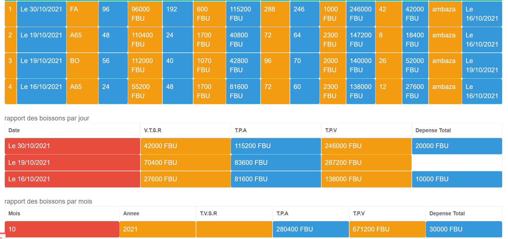
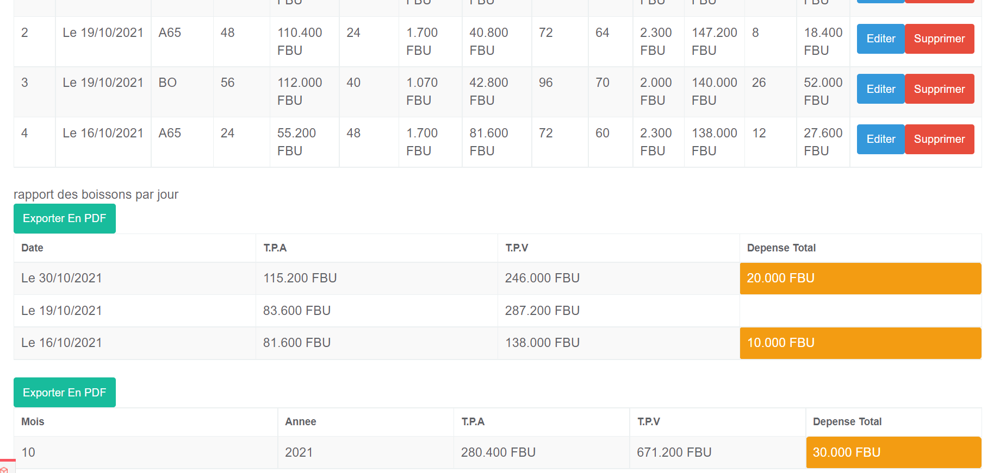
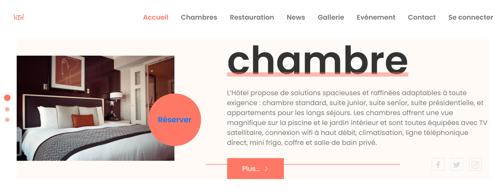
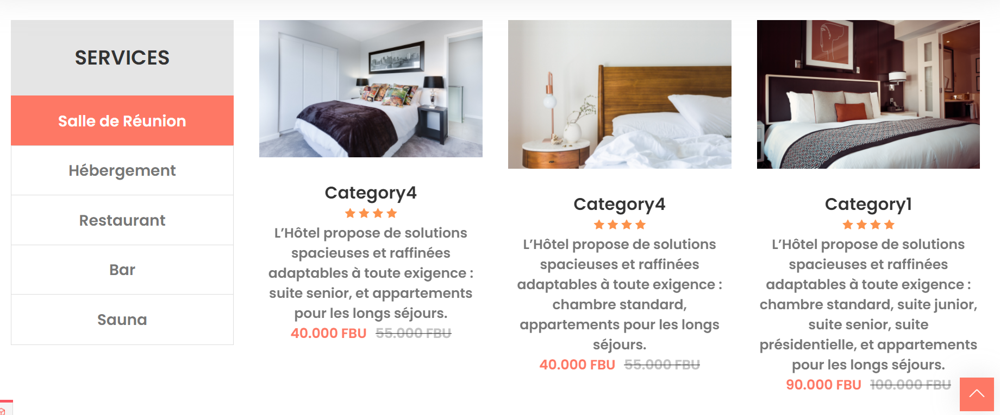

 

 
<h1>HOTEL MANAGEMENT SYSTEM</h1>

				#AMBAZA MARCELLIN

''    ''    ''            ''       """"""
''	  ''    '''	         '''	""
''    '' 	''	''	   '' ''	""
''""""'' 	''		""	  ''		"""""
''    ''  	''            ''			""
''    ''	''            ''	""		""
''    ''	''            ''	  """"

					FONCTIONNALITES
					'''''''''''''''
			1.gestion du stock
			2.gestion des achats
			3.gestion des ventes
			3.gestion des clients
			4.gestion des depenses
			5.gestion des chambres
			6.gestion des reservations
			7.gestion des chambres
			8.prise des commandes en ligne
			9.Alerte Stock
			10.Suivi du stock
			11.Etablissement d'un ticket de vente apres consommation
			12.Gestion des employees
			13.gestion des presences des employees
			14.gestion des rapports
			15.gestion des conges
			16.Statistiques du Systeme

N.B:
		-possibilite d'acceder a distance via PC ,smartPhone ,etc.
		-possibilite de gerer plusieurs choses en meme temps

AKABIRYA:
		-SIMPLICITE
		-RAPIDITE
		-SECURITE

 
 

---HELP----- TO INSTALL

 <h2>step1:</h2>
 	-copy 
 	-cd repository 
 	-git clone  
 step2.
 	-go to env.dusk.example and rename it as env.
 	-DB_CONNECTION=mysql
	-DB_HOST=127.0.0.1
	-DB_PORT=3306
	-DB_DATABASE=dbname
	-DB_USERNAME=root
	-DB_PASSWORD=

 step3.
 	-go to database file in config folder
 	'connections' => [

        'sqlite' => [
            'driver' => 'sqlite',
            'database' => env('DB_DATABASE', database_path('database.sqlite')),
            'prefix' => '',
        ],

        'mysql' => [
            'driver' => 'mysql',
            'host' => env('DB_HOST', '127.0.0.1'),
            'port' => env('DB_PORT', '3306'),
            'database' => env('DB_DATABASE', 'dbname'),
            'username' => env('DB_USERNAME', 'root'),
            'password' => env('DB_PASSWORD', ''),
            'unix_socket' => env('DB_SOCKET', ''),
            'charset' => 'utf8mb4',
            'collation' => 'utf8mb4_unicode_ci',
            'prefix' => '',
            'strict' => false,
            'engine' => null,
        ],

        'pgsql' => [
            'driver' => 'pgsql',
            'host' => env('DB_HOST', '127.0.0.1'),
            'port' => env('DB_PORT', '5432'),
            'database' => env('DB_DATABASE', 'forge'),
            'username' => env('DB_USERNAME', 'forge'),
            'password' => env('DB_PASSWORD', ''),
            'charset' => 'utf8',
            'prefix' => '',
            'schema' => 'public',
            'sslmode' => 'prefer',
        ],

        'sqlsrv' => [
            'driver' => 'sqlsrv',
            'host' => env('DB_HOST', 'localhost'),
            'port' => env('DB_PORT', '1433'),
            'database' => env('DB_DATABASE', 'forge'),
            'username' => env('DB_USERNAME', 'forge'),
            'password' => env('DB_PASSWORD', ''),
            'charset' => 'utf8',
            'prefix' => '',
        ],

        'dusk_testing' => [
            'driver' => 'sqlite',
            'database' => database_path('database.sqlite'),
            'prefix' => '',
        ],

    ],

   step4.
    -run the following commands  
    	*php artisan migrate 
    	*php artisan db:seed 
    	*php artisan serve